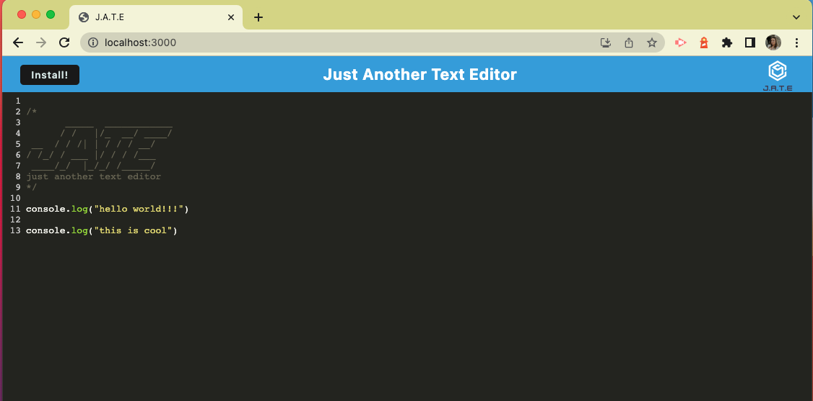
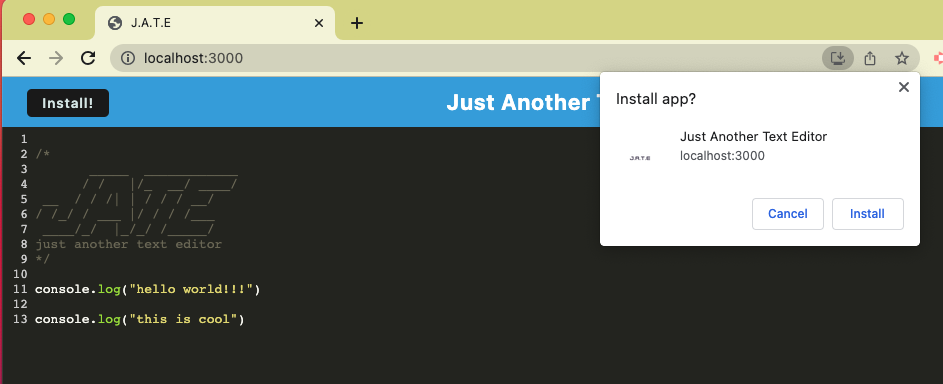
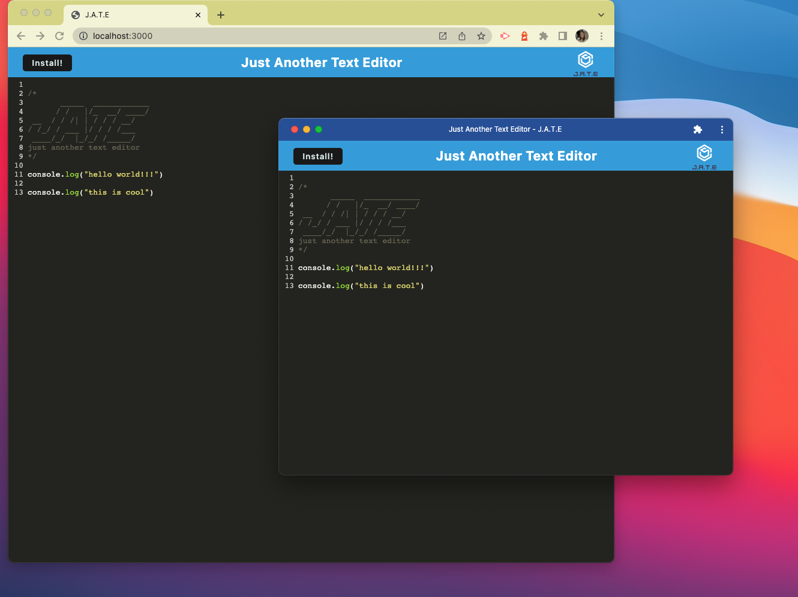

# PWA: Just Another Text Editor

## Application Links

* GitHub Repository for Application: https://github.com/mackenzie-wentworth/pwa-text-editor

* Heroku Deployed Application: https://pwa-jate-1.herokuapp.com/

## Description

For this week's Challenge, I was given a starter code to build a **Progressive Web App (PWA)** text editor called **JATE** (aka **Just Another Text Editor**). By incorporating PWA features, JATE extends offline funcitonality and can be utilized by users in both the browser and as a standalone app when installed. 

To get and store data, JATE uses a browser database **(IndexedDB)** and npm package **idb** for usability.

## Table of Contents

- [User Story](#user-story)
- [Acceptance Criteria](#acceptance-criteria)
- [Installation](#installation)
- [Usage](#usage)
- [Technologies Used](#technologies-used)
- [Questions](#questions)
- [License](#license)
- [Badges](#badges)

## User Story

```md
AS A developer
I WANT to create notes or code snippets with or without an internet connection
SO THAT I can reliably retrieve them for later use
```

## Acceptance Criteria

```md
GIVEN a text editor web application
WHEN I open my application in my editor
THEN I should see a client server folder structure
WHEN I run `npm run start` from the root directory
THEN I find that my application should start up the backend and serve the client
WHEN I run the text editor application from my terminal
THEN I find that my JavaScript files have been bundled using webpack
WHEN I run my webpack plugins
THEN I find that I have a generated HTML file, service worker, and a manifest file
WHEN I use next-gen JavaScript in my application
THEN I find that the text editor still functions in the browser without errors
WHEN I open the text editor
THEN I find that IndexedDB has immediately created a database storage
WHEN I enter content and subsequently click off of the DOM window
THEN I find that the content in the text editor has been saved with IndexedDB
WHEN I reopen the text editor after closing it
THEN I find that the content in the text editor has been retrieved from our IndexedDB
WHEN I click on the Install button
THEN I download my web application as an icon on my desktop
WHEN I load my web application
THEN I should have a registered service worker using workbox
WHEN I register a service worker
THEN I should have my static assets pre cached upon loading along with subsequent pages and static assets
WHEN I deploy to Heroku
THEN I should have proper build scripts for a webpack application
```

## Installation

1. To set up your environment, please begin by making sure you have the following already installed:

    * An open source code editor, such as [VS Code](https://code.visualstudio.com/)
    * [Git Bash](https://www.educative.io/answers/how-to-install-git-bash-in-windows) or [Zsh](https://github.com/ohmyzsh/ohmyzsh/wiki/Installing-ZSH) (to use in [Git](https://github.com/git-guides/install-git) command line)
    * [Node.js](https://nodejs.org/en)

2. Next, you will need to clone this [repository](https://github.com/mackenzie-wentworth/pwa-text-editor). From GitHub, copy the `SSH URL` and use the `git clone` command to paste the SSH URL to your terminal clipboard. 

    ```bash
        git clone [github ssh url]
    ```

3. Open the cloned repository in VS Code. Within VS Code, open a new integrated terminal from the root directory and type the following `npm` command to install the [Node Package Manager](https://www.npmjs.com/):

    ```bash
        npm init -y
    ```

4. In the same terminal from the root directory, next type in the following `npm` command to install [Node Modules](https://docs.npmjs.com/cli/v8/commands/npm-install):

    ```bash
        npm i
    ```

## Usage

Below are the steps to run JATE from your terminal so that you can view the application in a web browser and additionally through a separate installable app.

### *How to Use JATE:*
1. In an integrated terminal from the root directory, you first need to invoke the application by typing the following `npm` command:

    ```bash
        npm run start
    ```

2. You should see a response in your terminal that reads:

    ```bash
        Now listening on port: 3000 🚀
    ```

3. You are now ready to view JATE in your web browser using `localhost:3000`!

    

4. To install JATE as a separate application, click the black `Install` button on the top left-side of the page:

    

5. The following image demonstrates JATE once it's been installed as a separate applicaiton. 

    

## Technologies Used

* [VS Code](https://code.visualstudio.com/)
* [Node.js](https://nodejs.org/en)
* [Node Package Manager](https://www.npmjs.com/)
* [Express](https://expressjs.com/)
* [Nodemon](https://www.npmjs.com/package/nodemon)
* [Webpack](https://webpack.js.org/guides/getting-started/)
* [Workbox](https://developer.chrome.com/docs/workbox/the-ways-of-workbox/#using-a-bundler)
* [IndexedDB API](https://developer.mozilla.org/en-US/docs/Web/API/IndexedDB_API)
* [idb](https://www.npmjs.com/package/idb)
* [Concurrently](https://www.npmjs.com/package/concurrently)
* [Babel](https://babeljs.io/docs/)
* [Heroku](https://www.heroku.com/)
---

## Questions?

If you have any questions, please see my contact information below to reach me for inquiries:
* **GitHub**: mackenzie-wentworth, at https://github.com/mackenzie-wentworth
* **Email**: mwentworth28@gmail.com

## License

This project is covered under the [MIT License](./LICENSE). For more details, please click the license icon below under 'Badges'.

## Badges
[](https://opensource.org/licenses/MIT)